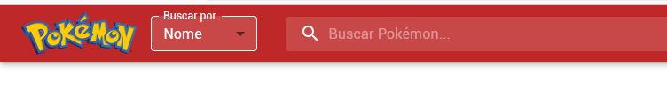
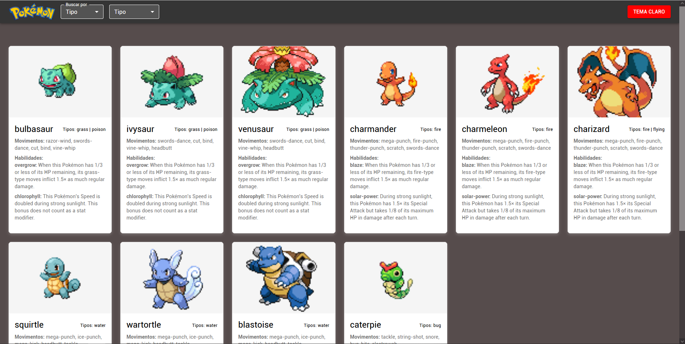

# Pokedex React Avançado

## Visão Geral

Aplicação Pokedex desenvolvida em React, consumindo a PokeAPI, com busca dinâmica, tema claro/escuro, carregamento incremental, modal de detalhes e testes automatizados.

## Funcionalidades

- **Busca por Nome ou Tipo:**
  - Seletor "Buscar por" permite alternar entre busca por nome (campo de texto) ou por tipo (combo box dinâmica).
  - Combo de tipos exibe apenas tipos disponíveis dos Pokémon já carregados.
  - Busca global: se o Pokémon não estiver carregado, é buscado na API e adicionado à lista.
- **Tema Claro/Escuro:**
  - Alternância instantânea entre temas, afetando toda a interface.
- **Carregamento Incremental:**
  - Inicialmente exibe 10 Pokémon, com botão para carregar mais 10 por vez.
- **Detalhes em Modal:**
  - Clique em um card abre um modal com detalhes completos do Pokémon (nome, tipos, habilidades, peso, altura, movimentos, etc.), tudo em português.
- **Skeleton Loading:**
  - Placeholders animados enquanto os dados são carregados.
- **Visual Consistente:**
  - Campos de seleção ("Buscar por" e "Tipo") com fundo, texto e borda sempre visíveis e contrastantes em ambos os temas.
- **Testes Automatizados:**
  - Testes com Jest e React Testing Library cobrindo renderização, busca, abertura de modal e busca global.

## Instalação e Execução

1. **Clone o repositório:**

```sh
git clone https://github.com/mfdzerohour/Desafio_DevEmDobro.git
cd Desafio_DevEmDobro/vite-projeto-pokedex-react-js_avancado
```

2. **Instale as dependências:**

```sh
npm install
```

3. **Inicie o servidor de desenvolvimento:**

```sh
npm run dev
```

Acesse: [http://localhost:5173](http://localhost:5173)

4. **Execute os testes automatizados:**

```sh
npm test
```

## Dicas e Solução de Problemas

- Se a porta 5173 estiver ocupada, o Vite usará outra porta (verifique o terminal).
- Certifique-se de que todas as dependências estão instaladas corretamente.
- Para problemas de roteamento, confira a configuração do vite.config.js para SPA.

## Screenshots




---